# Webhook Delivery System

A webhook delivery system built with FastAPI, Redis, and PostgreSQL.
Guarantees reliable event delivery with automatic retries, exponential backoff, and crash recovery.

---

## Architecture

---

## How It Works

**1. Event Ingestion**
Someone sends a `POST /events`. FastAPI saves the event to Postgres,
creates one `webhook_deliveries` row per active subscriber, pushes
each delivery ID into Redis, and returns `202 Accepted` immediately.

**2. Delivery Worker**
A background worker does `BRPOP` on the Redis queue. For each job it:
- Marks the delivery `IN_FLIGHT` in Postgres
- Makes an HTTP POST to the subscriber's endpoint
- On success → marks `DELIVERED`
- On failure → schedules a retry with exponential backoff

**3. Exponential Backoff**
Failed deliveries go into a Redis sorted set with a future timestamp as score.
A scheduler checks every 5 seconds and moves ready jobs back to the main queue.
Delay doubles each attempt: `2s → 4s → 8s → 16s → 32s`.
After 5 attempts the delivery is marked `DEAD`.

**4. Crash Recovery (Reaper)**
If the worker crashes while a job is `IN_FLIGHT`, that row stays stuck forever.
The reaper runs every 30 seconds and finds any `IN_FLIGHT` rows
where `updated_at` is older than 60 seconds — resets them to `PENDING`
and re-queues them.

**5. Idempotency**
Before delivering, the worker checks if status is already `DELIVERED` and skips.
This prevents double delivery if the same job gets picked up twice.

---


## Setup

**Requirements:** Python 3.11+, Docker

```bash
# 1. Start Postgres and Redis
docker compose up -d

# 2. Install dependencies
pip install -r requirements.txt

# 3. Create tables
python init_db.py

# 4. Start all processes (4 terminals)
uvicorn main:app --reload       # terminal 1 — API
python worker.py                # terminal 2 — delivery worker
python reaper.py                # terminal 3 — crash recovery
python receiver.py              # terminal 4 — test subscriber
```

---

## API Reference

| Method | Endpoint | Description |
|--------|----------|-------------|
| POST | `/events` | Emit an event |
| POST | `/subscriptions` | Register a webhook endpoint |
| GET | `/subscriptions` | List all subscriptions |
| GET | `/subscriptions/{id}` | Get a subscription |
| PATCH | `/subscriptions/{id}` | Enable / disable |
| DELETE | `/subscriptions/{id}` | Remove subscription |
| GET | `/deliveries` | Delivery history (filterable) |
| GET | `/deliveries/stats` | Success rates and attempt counts |

---

## Example Usage

```bash
# Register a subscriber
curl -X POST http://localhost:8000/subscriptions \
  -H "Content-Type: application/json" \
  -d '{"endpoint_url": "http://localhost:9000/webhook", "event_type": "order.placed"}'

# Send an event
curl -X POST http://localhost:8000/events \
  -H "Content-Type: application/json" \
  -d '{"event_type": "order.placed", "payload": {"order_id": "ORD123", "amount": 99.99}}'

# Check delivery status
curl http://localhost:8000/deliveries

# View stats
curl http://localhost:8000/deliveries/stats
```

---

## Tech Stack

- **FastAPI** — async Python web framework
- **PostgreSQL** — persistent state, delivery tracking
- **Redis** — job queue + delay queue (sorted set)
- **SQLAlchemy (async)** — database ORM
- **aiohttp** — async HTTP client for webhook delivery
- **Docker Compose** — local infrastructure