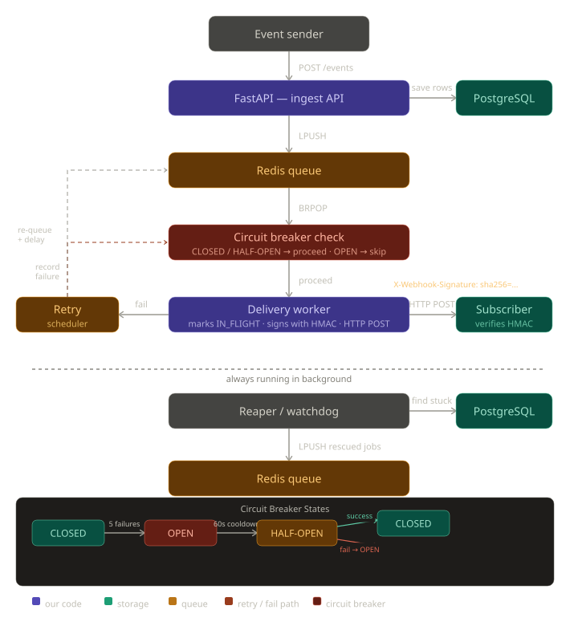

# Webhook Delivery System

A production-inspired webhook delivery system built with FastAPI, Redis, and PostgreSQL.
Guarantees reliable event delivery with automatic retries, exponential backoff, crash recovery, HMAC signature verification, and circuit breaking.

---

## Project Structure

```
webhook-delivery-system/
├── app/                          # Application package
│   ├── __init__.py
│   ├── main.py                   # FastAPI entry point
│   ├── database.py               # PostgreSQL connection
│   ├── redis_client.py           # Redis connection
│   ├── models.py                 # Pydantic models
│   ├── circuit_breaker.py        # Circuit breaker logic
│   └── routers/                  # API routes
│       ├── __init__.py
│       ├── deliveries.py         # GET /deliveries, /deliveries/stats
│       ├── events.py             # POST /events
│       └── subscriptions.py      # CRUD /subscriptions
├── workers/                      # Background processes
│   ├── __init__.py
│   ├── worker.py                 # Delivery worker + retry scheduler
│   └── reaper.py                 # Crash recovery
├── scripts/                      # Utility scripts
│   ├── __init__.py
│   ├── init_db.py                # Database initialization
│   └── webhook_receiver.py       # Test subscriber
├── tests/                        # Unit tests
│   └── __init__.py
├── docs/                         # Documentation & articles
│   ├── articles/
│   │   ├── article.html          # HTML Medium article
│   │   ├── article.md            # Markdown version
│   │   └── social.md             # Social media posts
│   └── diagrams/
│       ├── architecture.svg
│       ├── circuit_breaker_states.svg
│       ├── exponential_backoff.svg
│       └── webhook_arch_updated.svg
├── docker-compose.yml
├── requirements.txt
├── .gitignore
└── README.md
```

---

## Architecture



---

## Setup

**Requirements:** Python 3.11+, Docker

```bash
# 1. Start Postgres and Redis
docker compose up -d

# 2. Install dependencies
pip install -r requirements.txt

# 3. Create tables
python -m scripts.init_db

# 4. Start all processes (4 terminals)
uvicorn app.main:app --reload        # terminal 1 — API
python -m workers.worker              # terminal 2 — delivery worker
python -m workers.reaper              # terminal 3 — crash recovery
python -m scripts.webhook_receiver    # terminal 4 — test subscriber
```

---

## API Reference

| Method | Endpoint | Description |
|--------|----------|-------------|
| POST | `/events` | Emit an event |
| POST | `/subscriptions` | Register a webhook endpoint |
| GET | `/subscriptions` | List all subscriptions |
| GET | `/subscriptions/{id}` | Get a subscription |
| PATCH | `/subscriptions/{id}` | Enable / disable |
| DELETE | `/subscriptions/{id}` | Remove subscription |
| GET | `/deliveries` | Delivery history (filterable) |
| GET | `/deliveries/stats` | Success rates and attempt counts |

---

## Tech Stack

- **FastAPI** — async Python web framework
- **PostgreSQL** — persistent state, delivery tracking
- **Redis** — job queue (LIST) + delay queue (sorted set)
- **SQLAlchemy (async)** — database ORM
- **aiohttp** — async HTTP client for webhook delivery
- **Docker Compose** — local infrastructure
